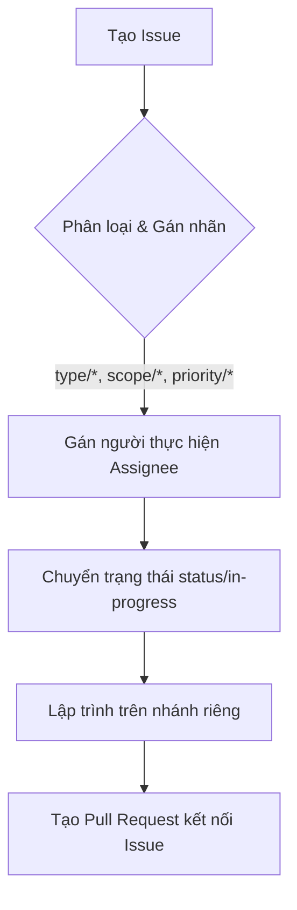
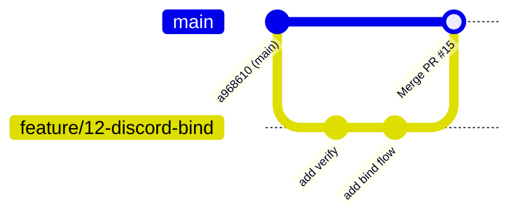

# Quy trình phát triển (Issue & PR Workflow) — v2

> Hướng dẫn thiết kế nhãn (labels), quy trình quản lý issue, pull request, và sơ đồ phối hợp công việc cho dự án `cse-mark` v2.

---

## 1. Thiết kế hệ thống nhãn (Label Design)

Để dễ dàng quản lý và tự động hóa bộ lọc công việc trong Gitea, dự án sử dụng hệ thống nhãn phân cấp theo tiền tố:

### 1.1. Phân loại theo Loại công việc (`type/*`)
Định dạng loại công việc của Issue hoặc PR:

| Nhãn | Màu sắc | Ý nghĩa |
|---|---|---|
| `type/bug` | `#d73a4a` (Đỏ) | Báo cáo lỗi code, lỗi bảo mật hoặc hành vi không mong muốn. |
| `type/feature` | `#a2eeef` (Xanh dương sáng) | Yêu cầu hoặc triển khai một tính năng mới. |
| `type/documentation` | `#0075ca` (Xanh lam đậm) | Cập nhật hoặc viết mới tài liệu hướng dẫn (`docs/`). |
| `type/refactor` | `#7057ff` (Tím) | Tái cấu trúc code (không đổi hành vi ngoại quan) để tối ưu hiệu năng/clean code. |
| `type/chore` | `#5319e7` (Tím tối) | Các tác vụ bảo trì hệ thống, cập nhật dependency hoặc cấu hình CI/CD. |

### 1.2. Phân loại theo Độ ưu tiên (`priority/*`)
Giúp điều phối và xác định thứ tự thực hiện:

| Nhãn | Màu sắc | Ý nghĩa |
|---|---|---|
| `priority/high` | `#e11d21` (Đỏ tươi) | Nghiêm trọng, cần xử lý ngay lập tức (blocking issue hoặc crash). |
| `priority/medium` | `#fbca04` (Vàng) | Độ ưu tiên trung bình, hoàn thành trong sprint hiện tại. |
| `priority/low` | `#1d76db` (Xanh dương) | Độ ưu tiên thấp, giải quyết khi có thời gian rảnh. |

### 1.3. Phân loại theo Phân hệ (`scope/*`)
Chỉ định phần code/dịch vụ bị ảnh hưởng:

| Nhãn | Màu sắc | Ý nghĩa |
|---|---|---|
| `scope/api` | `#fef2c0` (Vàng nhạt) | Dịch vụ HTTP API (`cmd/api`, `internal/delivery/api`). |
| `scope/fetcher` | `#c2e0c6` (Xanh lá nhạt) | Bộ lập lịch đồng bộ bảng điểm và roster (`cmd/fetcher`). |
| `scope/tele` | `#d4c5f9` (Tím nhạt) | Giao diện Bot Telegram (`cmd/tele`, `internal/delivery/tele`). |
| `scope/discord` | `#5319e7` (Xanh Discord) | Giao diện Bot Discord và bộ đồng bộ role (`cmd/discord`). |
| `scope/database` | `#bfd4f2` (Xanh xám) | Cấu trúc MongoDB, index, các repo trong `internal/infra/mongo`. |

### 1.4. Phân loại theo Trạng thái (`status/*`)
Theo dõi trạng thái của Issue (nếu không sử dụng Gitea Projects Board):

| Nhãn | Màu sắc | Ý nghĩa |
|---|---|---|
| `status/todo` | `#bfd4f2` | Đã lên kế hoạch nhưng chưa bắt đầu. |
| `status/in-progress` | `#fef2c0` | Đang được phát triển tích cực. |
| `status/review-needed` | `#fbca04` | Code đã xong, đang đợi review PR. |

---

## 2. Quy trình Quản lý Issue (Issue Lifecycle)

Mọi thay đổi code hoặc tính năng mới **bắt buộc** phải bắt đầu bằng một Issue.

### 2.1. Tạo Issue
* **Tiêu đề:** Tuân theo format `[Phân hệ] Tên issue` (Ví dụ: `[discord] Triển khai lệnh /bind gửi OTP`).
* **Nội dung:** Phải ghi rõ:
  - Bối cảnh/Yêu cầu nghiệp vụ.
  - Các bước cần triển khai cụ thể (checklist).
  - Kết quả mong đợi.
* **Gán nhãn:** Add tối thiểu 3 nhãn: 1 `type/*`, 1 `scope/*`, và 1 `priority/*`.

### 2.2. Nhận việc & Phát triển
* Thành viên nhận việc tự gán tên mình vào mục `Assignees`.
* Gắn nhãn `status/in-progress` cho Issue.
* Tạo nhánh (branch) mới từ `main` theo quy tắc đặt tên:
  - Tính năng mới: `feature/<issue-id>-<tên_ngắn>` (vd: `feature/12-discord-bind`).
  - Sửa lỗi: `bugfix/<issue-id>-<tên_ngắn>` (vd: `bugfix/15-ttl-index-expiry`).

---

## 3. Quy trình Pull Request (PR Workflow)

### 3.1. Tạo PR nháp (Draft / WIP)
* Khi mới bắt đầu phát triển, khuyến khích tạo PR dạng **Draft** (hoặc đặt tiêu đề bắt đầu bằng `WIP: `) để:
  - Nhận feedback sớm từ các thành viên khác.
  - Cho phép hệ thống CI tự động kiểm tra cú pháp và build thử.
* Trong phần mô tả PR, sử dụng từ khóa liên kết Gitea để tự động đóng Issue khi merge (Ví dụ: `Closes #12`).

### 3.2. Yêu cầu Review (Review Ready)
* Khi phát triển xong, chạy test cục bộ và đảm bảo code sạch.
* Đổi PR từ Draft sang Ready (hoặc bỏ tiền tố `WIP:`).
* Gán nhãn `status/review-needed` cho PR.
* Gán ít nhất 1 thành viên Admin làm **Reviewer**.

### 3.3. Tiêu chuẩn thông qua (Merge Checklist)
Một PR chỉ được phép merge khi thỏa mãn toàn bộ các điều kiện sau:
1. [ ] **CI Pass:** Pipeline Gitea Actions kiểm tra tĩnh (golangci-lint), chạy test (`go test`) và build Docker images thành công.
2. [ ] **Review Approved:** Được duyệt và approve bởi ít nhất một Admin.
3. [ ] **Không xung đột (No Conflicts):** Đã được rebase/merge với code mới nhất trên nhánh `main`.

### 3.4. Phương thức Merge (Merge Style)
* Ưu tiên sử dụng **Rebase and Merge** hoặc **Squash and Merge** đối với các feature branch nhỏ để giữ lịch sử commit trên nhánh `main` luôn là một đường thẳng (linear history), dễ theo dõi và rollback.
* Tránh sử dụng merge commit (`Merge branch '...'`) thông thường để tránh làm rối đồ thị Git.

---

## 4. Các mốc triển khai (Milestones)

Các issue sẽ được gom nhóm vào các Milestones tương ứng với các pha đã thỏa thuận trong [migration.md](file:///home/agy/cse-mark/docs/v2/migration.md#L17):

1. **Milestone: Pha 1 - Database Schema & Indexing**
   - Thiết lập collection `discord_mappings` mới.
   - Thêm trường `role` và dọn dẹp `is_teacher` trong collection `users`.
   - Tạo index độc nhất 1:1:1 cho `bindings` và index TTL (Date) cho `verifications`.
2. **Milestone: Pha 2 - Discord Integration & Sync Services**
   - Triển khai `cmd/discord` và dockerfile dịch vụ mới.
   - Viết scheduler `classsync` đồng bộ role tự động (bỏ qua Admin).
   - Thiết lập cơ chế bọc client xử lý Rate-Limit API của Discord.
3. **Milestone: Pha 3 - Telegram Update & Cutover**
   - Cập nhật logic `/bind` trên Telegram và nâng cấp `/mark` chỉ cho phép SV đã liên kết.
   - Chuyển giao toàn bộ lệnh tạo/xóa lớp sang quyền Admin.
4. **Milestone: Pha 4 - Operation & Acceptance Test**
   - Kiểm thử toàn diện và theo dõi logs trong 24 giờ.
