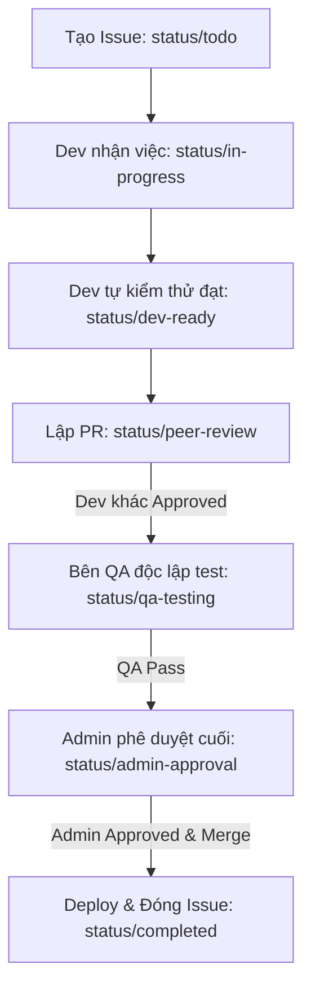

# Quy trình phát triển (Issue & PR Workflow) — v2

> Hướng dẫn thiết kế nhãn (labels), quy trình quản lý issue, pull request, và sơ đồ phối hợp công việc cho dự án `cse-mark` v2.

---

## 1. Thiết kế hệ thống nhãn (Label Design)

Để dễ dàng quản lý và tự động hóa bộ lọc công việc trong Gitea, dự án sử dụng hệ thống nhãn phân cấp theo tiền tố:

### 1.1. Phân loại theo Loại công việc (`type/*`)
Định dạng loại công việc của Issue hoặc PR:

| Nhãn | Màu sắc | Ý nghĩa |
|---|---|---|
| `type/bug` | `#d73a4a` (Đỏ) | Báo cáo lỗi code, lỗi bảo mật hoặc hành vi không mong muốn. |
| `type/feature` | `#a2eeef` (Xanh dương sáng) | Yêu cầu hoặc triển khai một tính năng mới. |
| `type/documentation` | `#0075ca` (Xanh lam đậm) | Cập nhật hoặc viết mới tài liệu hướng dẫn (`docs/`). |
| `type/refactor` | `#7057ff` (Tím) | Tái cấu trúc code (không đổi hành vi ngoại quan) để tối ưu hiệu năng/clean code. |
| `type/chore` | `#5319e7` (Tím tối) | Các tác vụ bảo trì hệ thống, cập nhật dependency hoặc cấu hình CI/CD. |

### 1.2. Phân loại theo Độ ưu tiên (`priority/*`)
Giúp điều phối và xác định thứ tự thực hiện:

| Nhãn | Màu sắc | Ý nghĩa |
|---|---|---|
| `priority/high` | `#e11d21` (Đỏ tươi) | Nghiêm trọng, cần xử lý ngay lập tức (blocking issue hoặc crash). |
| `priority/medium` | `#fbca04` (Vàng) | Độ ưu tiên trung bình, hoàn thành trong sprint hiện tại. |
| `priority/low` | `#1d76db` (Xanh dương) | Độ ưu tiên thấp, giải quyết khi có thời gian rảnh. |

### 1.3. Phân loại theo Phân hệ (`scope/*`)
Chỉ định phần code/dịch vụ bị ảnh hưởng:

| Nhãn | Màu sắc | Ý nghĩa |
|---|---|---|
| `scope/api` | `#fef2c0` (Vàng nhạt) | Dịch vụ HTTP API (`cmd/api`, `internal/delivery/api`). |
| `scope/fetcher` | `#c2e0c6` (Xanh lá nhạt) | Bộ lập lịch đồng bộ bảng điểm và roster (`cmd/fetcher`). |
| `scope/tele` | `#d4c5f9` (Tím nhạt) | Giao diện Bot Telegram (`cmd/tele`, `internal/delivery/tele`). |
| `scope/discord` | `#5319e7` (Xanh Discord) | Giao diện Bot Discord và bộ đồng bộ role (`cmd/discord`). |
| `scope/database` | `#bfd4f2` (Xanh xám) | Cấu trúc MongoDB, index, các repo trong `internal/infra/mongo`. |

### 1.4. Phân loại theo Trạng thái & Các lớp Review (`status/*`)
Theo dõi tiến độ phát triển và các lớp kiểm duyệt độc lập từ Dev đến Admin:

| Nhãn | Màu sắc | Ý nghĩa |
|---|---|---|
| `status/todo` | `#bfd4f2` (Xám xanh) | Đã lập kế hoạch, chờ phân bổ thực hiện. |
| `status/in-progress` | `#fef2c0` (Vàng nhạt) | Dev đang tiến hành code. |
| `status/dev-ready` | `#a2eeef` (Xanh dương sáng) | Dev đã viết xong code & tự kiểm thử (Unit test/Local) thành công. |
| `status/peer-review` | `#7057ff` (Tím) | Chờ dev khác trong dự án review code chéo (Peer Code Review). |
| `status/qa-testing` | `#fbca04` (Cam) | Chuyển giao cho bên QA/Tester độc lập kiểm thử hộp đen và check lỗi nghiệp vụ. |
| `status/admin-approval` | `#e11d21` (Đỏ) | Chờ Admin/Maintainer phê duyệt cấu hình, bảo mật và kiến trúc trước khi merge. |
| `status/completed` | `#2cbe4e` (Xanh lá) | PR đã merge, issue đã hoàn thành và deploy thành công. |

---

## 2. Quy trình kiểm duyệt Issue (Issue Lifecycle)

Mọi yêu cầu sửa lỗi hay tính năng mới phải đi qua 3 bên kiểm duyệt độc lập (Dev chéo, QA, Admin) theo luồng:

### 2.1. Tạo Issue & Bắt đầu phát triển
* **Tiêu đề:** Tuân theo format `[Phân hệ] Tên issue` (Ví dụ: `[discord] Triển khai lệnh /bind gửi OTP`).
* **Nội dung:** Ghi rõ yêu cầu, checklist triển khai, và tiêu chí nghiệm thu (UAT).
* **Gán nhãn khởi tạo:** `type/*`, `scope/*`, `priority/*`, và gán `status/todo`.
* **Nhận việc:** Dev gán tên mình vào `Assignees` và đổi sang `status/in-progress`.
* **Tạo nhánh:** Tạo nhánh từ `main` dạng `feature/...` hoặc `bugfix/...`.

---

## 3. Quy trình Pull Request & Lớp kiểm duyệt (PR Review Workflow)

Mỗi Pull Request đại diện cho một chặng kiểm duyệt độc lập, trạng thái PR được cập nhật qua nhãn `status/*` tương ứng:

### 3.1. Tạo PR nháp (Draft / WIP)
* Khi bắt đầu code, tạo Draft PR (hoặc prefix `WIP: `) để chạy CI sớm và nhận phản hồi sớm.
* Liên kết tự động đóng issue bằng từ khóa: `Closes #<issue-id>` trong mô tả PR.

### 3.2. Chặng 1: Peer Code Review (`status/peer-review`)
* Khi dev tự test local thấy đạt (`status/dev-ready`), chuyển PR sang trạng thái Ready và gán nhãn `status/peer-review`.
* **Hành động:** Thành viên dev khác trong team nhảy vào đọc code, kiểm tra logic, comment góp ý.
* **Yêu cầu thông qua:** Nhận được ít nhất 1 **Approval** từ dev khác trên PR.

### 3.3. Chặng 2: Independent QA Testing (`status/qa-testing`)
* Sau khi code review xong, gán nhãn `status/qa-testing` và chuyển cho bên QA/Tester độc lập.
* **Hành động:** QA lấy code từ nhánh PR để deploy thử lên môi trường Staging/Canary, thực hiện kiểm thử hộp đen (Black-box testing), kiểm tra các kịch bản biên, kịch bản lỗi (spam OTP, email sai roster, Discord rate-limit).
* **Yêu cầu thông qua:** QA phản hồi trên PR hoặc đóng vai trò reviewer chấp thuận (QA Approved). Nếu phát hiện bug, chuyển về `status/in-progress` để dev sửa.

### 3.4. Chặng 3: Admin & Security Approval (`status/admin-approval`)
* Sau khi QA pass, gán nhãn `status/admin-approval`.
* **Hành động:** Admin/Security Reviewer kiểm tra toàn diện:
  - Tính an toàn của biến môi trường, thông tin bảo mật (SMTP, Discord Token).
  - Đảm bảo database index (Unique index bindings, TTL Date) chính xác.
  - Phù hợp với định hướng kiến trúc clean-architecture của dự án.
* **Yêu cầu thông qua:** Admin chấp thuận (Approved) và thực hiện click **Merge**.

### 3.5. Đóng công việc (`status/completed`)
* PR được merge bằng phương thức **Rebase and Merge** hoặc **Squash and Merge**.
* Trạng thái PR và Issue liên kết tự động chuyển sang `status/completed`. Nhánh phát triển được xóa sạch.

---

## 4. Các mốc triển khai (Milestones)

Các issue sẽ được gom nhóm vào các Milestones tương ứng với các pha đã thỏa thuận trong [migration.md](file:///home/agy/cse-mark/docs/v2/migration.md#L17):

1. **Milestone: Pha 1 - Database Schema & Indexing**
   - Thiết lập collection `discord_mappings` mới.
   - Thêm trường `role` và dọn dẹp `is_teacher` trong collection `users`.
   - Tạo index độc nhất 1:1:1 cho `bindings` và index TTL (Date) cho `verifications`.
2. **Milestone: Pha 2 - Discord Integration & Sync Services**
   - Triển khai `cmd/discord` và dockerfile dịch vụ mới.
   - Viết scheduler `classsync` đồng bộ role tự động (bỏ qua Admin).
   - Thiết lập cơ chế bọc client xử lý Rate-Limit API của Discord.
3. **Milestone: Pha 3 - Telegram Update & Cutover**
   - Cập nhật logic `/bind` trên Telegram và nâng cấp `/mark` chỉ cho phép SV đã liên kết.
   - Chuyển giao toàn bộ lệnh tạo/xóa lớp sang quyền Admin.
4. **Milestone: Pha 4 - Operation & Acceptance Test**
   - Kiểm thử toàn diện và theo dõi logs trong 24 giờ.
